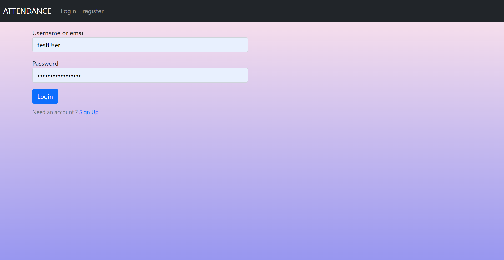
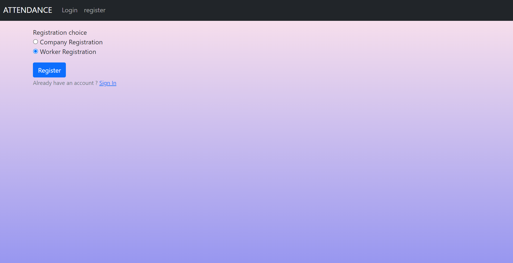
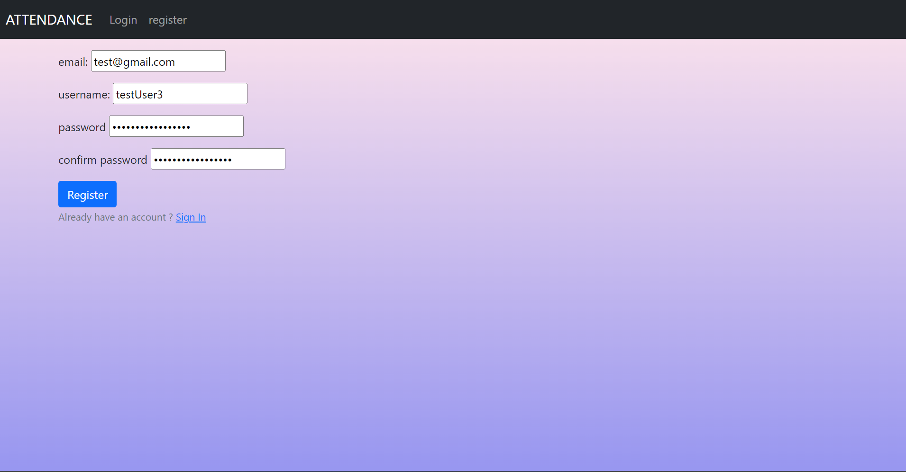
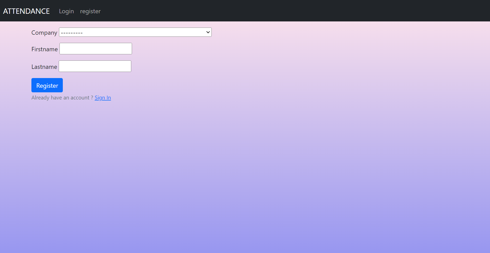
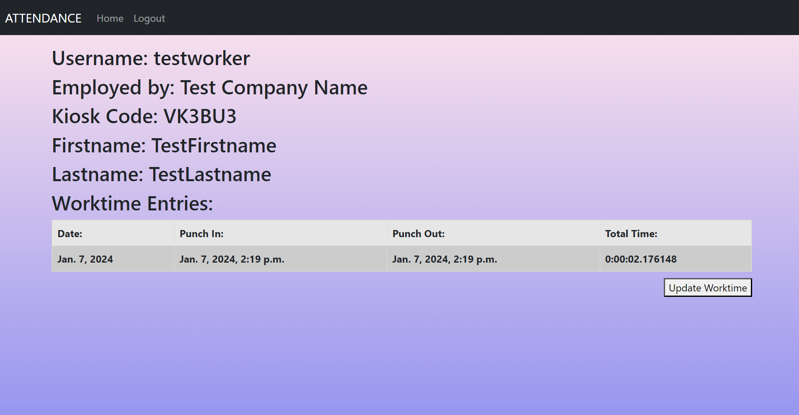
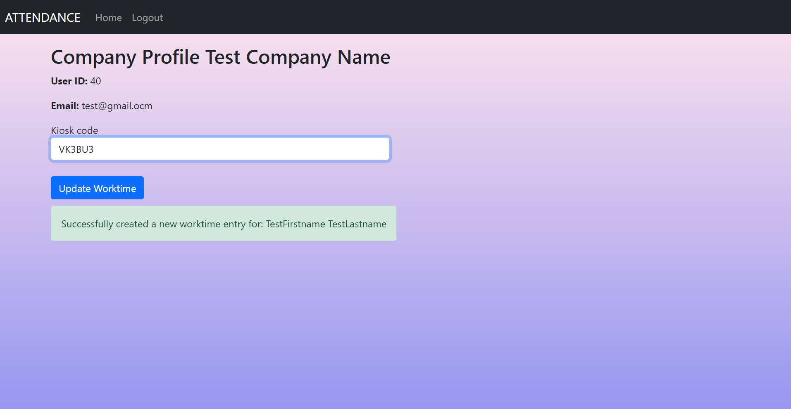

# Attendance - simple worktime tracking web app 

Create a company, create a worker employed by the company.
Create worktime entries either from the worker profile or by entering the kiosk code in the company profile.

## Screenshots

| Log In | User type choice | Registration |
|  |  |  |
| Worker Registration | Worker View | Company View |
|  |  |  |

## Functionality

- Log in
  - via username & password
  - via email & password
  - via email or username & password
- Create an account
- Log out
- Provide Company/Worker information
- Automatic unique Kiosk Code
- Single button worktime updates
- Enter kiosk code to update worktime

## Installing

### Clone the project

```git
git clone https://github.com/kamisul582/ZTPAI
```

### Install dependencies & activate venv

unix / mac

``` python
python3 -m pip install --user virtualenv
```

windows

```python
py -m pip install --user virtualenv
```

create a virtual environment

unix / mac

```python
python3 -m venv env
```

windows

```pyhton
py -m venv env
```

And tell pip to install all of the packages in this file using the -r flag:

unix / mac

``` python
python3 -m pip install -r requirements.txt
```

windows

```python
py -m pip install -r requirements.txt
```

### Configure the settings (connection to the database, and other)

1. Edit `core/settings.py` if you want to develop the project.

2. Create .env file in `core/` and add your environment variable

3. python manage.py makemigrations

4. python manage.py migrate

#### A development server

Just run this command:

``` python
python manage.py runserver
```
